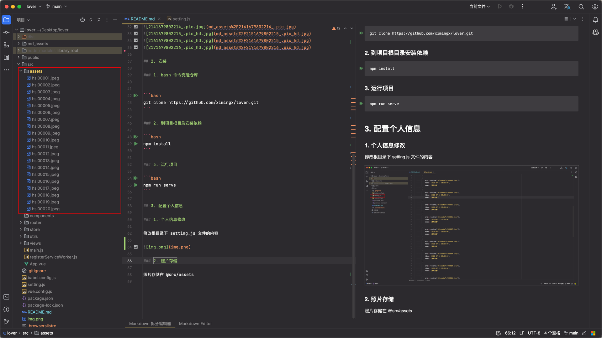

# 情侣恋爱记录网站

github地址: https://github.com/ximingx/lover

## 1. 介绍

送给女朋友恋爱一周年纪念日的礼物，一个情侣恋爱记录网站，记录我们的点点滴滴。

虽然是24考研，但是还是会抽空更新的。

## 2. 预览效果

https://lover.ximingx.org.cn

### 1. mac


### 2. ipad


### 3. iphone


## 2. 安装

### 1. bash 命令克隆仓库


```bash
git clone https://github.com/ximingx/lover.git
```

### 2. 到项目根目录安装依赖

```bash
npm install
```

### 3. 运行项目

```bash
npm run serve
```

## 3. 配置个人信息

### 1. 个人信息修改

修改根目录下 setting.js 文件的内容

```js
const {ref} = require('vue')
module.exports = {
    day: '2022-04-15 09:00:00',
    // 男方信息
    bridegroom: '秦书翔',
    // 中间的消息可以是 love 也可以是 ❤️
    love: 'Love',
    // 女方信息
    bride: '郝思璐',
    // 在一起发生事件的信息
    calendarList: [
        {
            // 日期
            date: '2022-04-15',
            // 事件
            desc: '我们在一起啦'
        },
        {
            date: '2023-03-12',
            desc: '第一次去你们学校玩'
        },
        {
            date: '2023-03-20',
            desc: '和你从济南玩了回来'
        }
    ],
    // 照片墙的信息
    recordList: [
        {
            // 照片的地址
            src: require('@/assets/hsl00001.jpeg'),
            // 照片的时间
            time: '2021-07-13 15:20:00',
            // 照片的描述
            desc: '漂亮崽崽'
        },
        {
            src: require('@/assets/hsl00002.jpeg'),
            time: '2021-07-13 15:20:00',
            desc: '漂亮崽崽'
        },
        {
            src: require('@/assets/hsl00003.jpeg'),
            time: '2021-07-13 15:20:00',
            desc: '漂亮崽崽'
        },
        {
            src: require('@/assets/hsl00004.jpeg'),
            time: '2021-07-13 15:20:00',
            desc: '漂亮崽崽'
        },
        {
            src: require('@/assets/hsl00005.jpeg'),
            time: '2021-07-13 15:20:00',
            desc: '漂亮崽崽'
        },
        {
            src: require('@/assets/hsl00006.jpeg'),
            time: '2021-07-13 15:20:00',
            desc: '漂亮崽崽'
        },
        {
            src: require('@/assets/hsl00007.jpeg'),
            time: '2021-07-13 15:20:00',
            desc: '漂亮崽崽'
        },
        {
            src: require('@/assets/hsl00008.jpeg'),
            time: '2021-07-13 15:20:00',
            desc: '漂亮崽崽'
        },
        {
            src: require('@/assets/hsl00009.jpeg'),
            time: '2021-07-13 15:20:00',
            desc: '漂亮崽崽'
        },
        {
            src: require('@/assets/hsl00010.jpeg'),
            time: '2021-07-13 15:20:00',
            desc: '漂亮崽崽'
        },
        {
            src: require('@/assets/hsl00011.jpeg'),
            time: '2021-07-13 15:20:00',
            desc: '漂亮崽崽'
        },
        {
            src: require('@/assets/hsl00012.jpeg'),
            time: '2021-07-13 15:20:00',
            desc: '漂亮崽崽'
        },
        {
            src: require('@/assets/hsl00013.jpeg'),
            time: '2021-07-13 15:20:00',
            desc: '漂亮崽崽'
        },
        {
            src: require('@/assets/hsl00014.jpeg'),
            time: '2021-07-13 15:20:00',
            desc: '漂亮崽崽'
        },
        {
            src: require('@/assets/hsl00015.jpeg'),
            time: '2021-07-13 15:20:00',
            desc: '漂亮崽崽'
        },
        {
            src: require('@/assets/hsl00016.jpeg'),
            time: '2021-07-13 15:20:00',
            desc: '漂亮崽崽'
        },
        {
            src: require('@/assets/hsl00017.jpeg'),
            time: '2021-07-13 15:20:00',
            desc: '漂亮崽崽'
        },
        {
            src: require('@/assets/hsl00018.jpeg'),
            time: '2021-07-13 15:20:00',
            desc: '漂亮崽崽'
        },
        {
            src: require('@/assets/hsl00019.jpeg'),
            time: '2021-07-13 15:20:00',
            desc: '漂亮崽崽'
        },
        {
            src: require('@/assets/hsl00020.jpeg'),
            time: '2021-07-13 15:20:00',
            desc: '漂亮崽崽'
        }
    ],
    // tcp备案
    websiteFiling: '晋ICP备2023000118号',
    // tcp备案链接
    websiteFilingLink: 'https://www.beianx.cn/search/晋ICP备2023000118号' ,
    // 公安备案
    policeFiling: '晋公网安备 14112402160014号',
    // 公安备案链接
    policeFilingLink: 'http://www.beian.gov.cn/portal/registerSystemInfo?recordcode=14112402160014'
}

```


### 2. 照片存储

照片存储在 @src/assets


